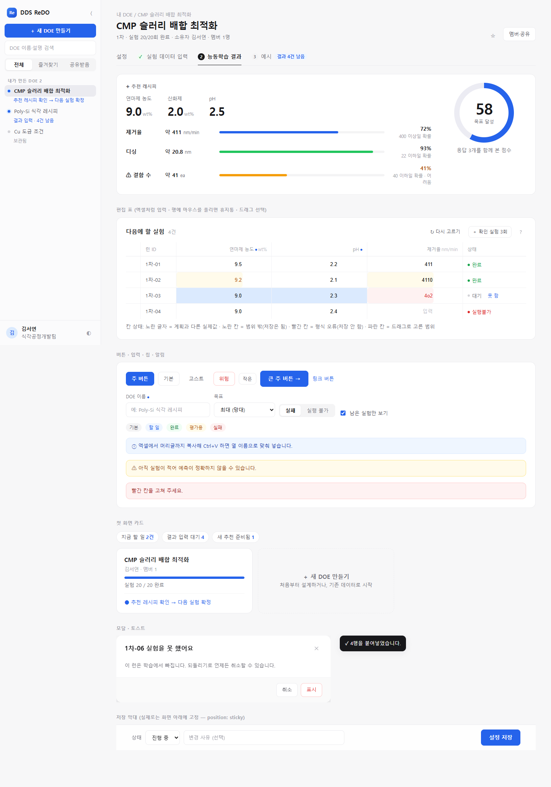
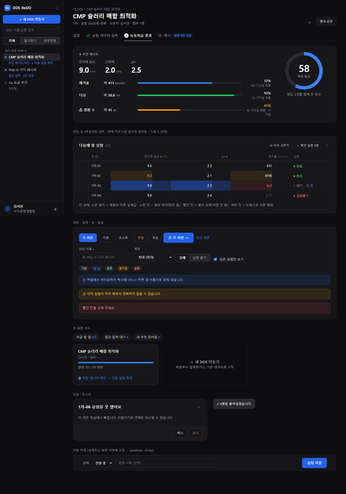

# DDS ReDO 디자인 시스템 (다른 프로젝트에 재사용하기)

이 문서는 **DDS ReDO의 UI/UX를 다른 웹앱에 그대로 옮기기 위한 안내서**입니다.
"DDS_ReDO 프로젝트의 디자인을 참고해서 만들어 줘"라는 요청을 받은 사람(또는 AI 도구)은 **이 문서 하나만 읽고** 같은 느낌의 화면을 만들 수 있어야 합니다.

| 미리보기 (밝은 화면) | 미리보기 (어두운 화면) |
|---|---|
|  |  |

실제 앱 화면은 [사용 매뉴얼](docs/USER_MANUAL.md)에 있습니다. 대표 화면은 다음과 같습니다.
- [첫 화면](frontend/public/manual/img/02-home.png)
- [설정 폼](frontend/public/manual/img/03-new-doe.png)
- [편집 표](frontend/public/manual/img/07-step1.png)
- [결과 요약](frontend/public/manual/img/12-step2.png)
- [다크 모드](frontend/public/manual/img/22-dark.png)

---

## 0. 적용 순서 (AI 도구·개발자용 요약)

1. **토큰과 키트 복사**: [`frontend/src/design/tokens.css`](frontend/src/design/tokens.css)와 [`frontend/src/design/kit.css`](frontend/src/design/kit.css)를 그대로 복사해 **이 순서로** 불러옵니다. 색·간격 값을 새로 만들지 말고 토큰(`var(--ink)`, `var(--panel)` …)만 씁니다.
   - 원격에서 받을 때는 `https://raw.githubusercontent.com/psm5556/DDS_ReDO/main/frontend/src/design/tokens.css`(kit.css도 같은 경로)를 씁니다.
2. **글꼴**: `npm i pretendard` 후 `import "pretendard/dist/web/variable/pretendardvariable-dynamic-subset.css"`. 외부 CDN은 쓰지 않습니다.
3. **테마**: `<html data-theme="light|dark">`. 첫 그리기 전에 정합니다. 처음에는 OS 설정을 따르고, 사용자가 바꾸면 localStorage에 기억합니다. → [`theme.ts`](frontend/src/theme.ts)
4. **앱 틀**: 왼쪽 사이드바(너비 드래그 조절, 접기 Ctrl+B) + 오른쪽 작업 영역. **상단바는 두지 않습니다.** → [3장](#3-화면-틀레이아웃)
5. **화면마다 주 버튼(파랑)은 하나**만 둡니다. 나머지는 기본(흰 바탕+선) 또는 고스트(글자만) 버튼입니다.
6. **표는 엑셀처럼**: 칸이 곧 입력 상자이고, 붙여넣기·드래그 복사·Enter 이동이 됩니다. 삭제 버튼은 행 맨 앞에 두고 마우스를 올렸을 때만 보입니다. → [4-4](#4-4-표-엑셀처럼-입력)
7. 마지막으로 [6장 UX 규칙](#6-ux-규칙-이-프로젝트에서-사용자가-정한-것)과 [8장 점검표](#8-점검표)로 확인합니다.

> 미리보기 페이지 [`docs/design/preview.html`](docs/design/preview.html)은 **이 두 CSS 파일만으로** 그려집니다. 새 화면을 만들 때 이 파일의 마크업을 복사해 시작하면 가장 빠릅니다.

---

## 1. 디자인 원칙

| 원칙 | 구체적으로 |
|---|---|
| **조용한 바탕, 한 가지 포인트 색** | 무채색(zinc) 회색 바탕 + 흰 카드. 색은 **파랑 `#2563eb` 하나**만 강조에 씁니다(주 버튼·선택·링크·할 일 표시). |
| **그림자 대신 선** | 카드·표는 `1px var(--line)`로 구분하고 그림자는 거의 쓰지 않습니다(마우스를 올린 카드, 모달만). |
| **위계는 크기와 굵기로** | 중요한 숫자는 크게(30~40px, 굵게), 보조 정보는 작은 회색(12~13px, `--ink-3/4`). |
| **테두리 없는 표** | 머리글은 작은 회색 글자, 행 구분은 아주 옅은 가로선, 세로줄은 거의 안 보이게. |
| **쉬운 말** | 통계·기술 용어 대신 사용자의 말을 씁니다. "다음 실험을 고른 이유", "규격 안에 들 확률" |
| **색만으로 전달하지 않기** | 경고는 색 + 아이콘(⚠) + 문구. 상태는 점 + 글자. |
| **안내 문구는 최소** | 설명 띠를 늘어놓지 않고 `?` 툴팁이나 `title` 속성으로 숨깁니다. |

---

## 2. 토큰 (`tokens.css`)

모든 값은 CSS 변수입니다. **새 색을 만들지 말고** 아래 이름을 쓰세요. 어두운 화면 값은 `:root[data-theme="dark"]`에서 같은 이름으로 바뀝니다.

### 2-1. 색

| 토큰 | 밝은 화면 | 어두운 화면 | 쓰는 곳 |
|---|---|---|---|
| `--paper` | `#f7f7f8` | `#0e0e10` | 페이지 바탕 |
| `--panel` | `#ffffff` | `#17171a` | 카드·표·입력 바탕 |
| `--panel-2` | `#fafafa` | `#1b1b1f` | 약하게 구분할 바탕(모달 아래 막대) |
| `--panel-3` | `#f4f4f5` | `#26262b` | 칩, 마우스를 올린 버튼, 진행 막대 바탕 |
| `--side-bg` | `#fbfbfc` | `#121214` | 사이드바 바탕 |
| `--line` | `#ececef` | `#2a2a30` | 카드·표 테두리 |
| `--line-2` | `#f3f3f5` | `#222227` | 표 행 구분선 |
| `--vline` | `#f3f3f6` | `#202025` | 표 세로줄(거의 안 보이게) |
| `--ink` | `#18181b` | `#f4f4f5` | 본문·제목 |
| `--ink-2` | `#52525b` | `#d4d4d8` | 보조 본문, 버튼 글자 |
| `--ink-3` | `#71717a` | `#a1a1aa` | 설명 글 |
| `--ink-4` | `#a1a1aa` | `#7c7c86` | 표 머리글, 흐린 정보 |
| `--brand` | `#2563eb` | `#3b82f6` | 링크·선택·할 일 (**주 버튼은 두 테마 모두 `#2563eb` 고정**) |
| `--brand-soft` | `#eff6ff` | 파랑 14% | 선택된 행·배지 바탕 |
| `--ok` / `--warn` / `--err` | `#16a34a` / `#b45309` / `#dc2626` | 밝게 조정 | 완료 / 경고 / 오류 (각각 `-soft`, `-ring` 바탕·테두리 있음) |
| `--mean` / `--sigma` / `--epi` | 청록 / 보라 / 회청 | 밝게 조정 | 데이터 의미 색 (평균 / 산포 / 불확실성) — 이 앱 고유 |
| `--sel` / `--sel-head` | `#dbeafe` / `#bfdbfe` | 파랑 28% / 40% | 표 드래그 선택 |
| `--hover` / `--active` / `--row-hover` | 옅은 회색 | 어두운 회색 | 사이드바·표 마우스 올림/선택 |
| `--glass` | 흰색 92% | 패널 90% | 고정 저장 막대(blur와 함께) |
| `--toast-bg` | `#18181b` | `#2a2a30` | 토스트·툴팁 |

### 2-2. 글자·모양

| 토큰 | 값 | 쓰는 곳 |
|---|---|---|
| `--font` | Pretendard Variable → Inter → 맑은 고딕 | 전체 (숫자는 `font-variant-numeric: tabular-nums`) |
| `--fs-xs / s / m / l / xl / xxl` | 12 / 13 / 14 / 16 / 20 / 26px | 표 머리글 / 보조 / 본문 / 카드 제목 / 화면 제목 / 첫 화면 제목 |
| 큰 숫자 | 30px 650 (게이지 40px 700) | 추천 값, 점수 |
| `--radius-s / m / l` | 8 / 10 / 14px | 버튼·입력 / 알림 / 카드·모달 |
| `--shadow-card-md` | 0 4px 16px 6% | 마우스를 올린 카드 |
| `--shadow-modal` | 0 24px 64px 28% | 모달·메뉴 |
| `--side-w` | 264px (200~480) | 사이드바 너비 |

---

## 3. 화면 틀(레이아웃)

```
┌──────────────┬────────────────────────────────────────────────┐
│ Re 앱이름  ⟨ │ 내 항목 / 항목 이름                  ☆ [멤버·공유] │  ← 경로 + 큰 제목 + 한 줄 요약
│ [+ 새로 만들기]│ 항목 이름 (24px)                                  │
│ ⌕ 검색        │ 1차 · 20/20 완료 · 소유자 · 멤버 1명              │
│ [전체|즐겨찾기]│ 설정   ✓ 1단계   ● 2단계   ← 밑줄 탭                 │
│ 내 항목 2     │ ┌──────────────────────────────────────────────┐ │
│ ● 항목 A      │ │ 흰 카드 (radius 14, 1px 선, 여백 22×24)        │ │
│   다음 할 일  │ └──────────────────────────────────────────────┘ │
│ ○ 항목 B      │                                                  │
│ ──────────── │                                                  │
│ (김) 이름 ☾ ⎋ │ [고정 저장 막대: 상태 · 사유 ·········· [저장]]    │
└──────────────┴────────────────────────────────────────────────┘
   ↑ 오른쪽 가장자리 드래그 = 너비 조절, Ctrl+B = 접기(아이콘만 남는 56px 막대)
```

| 영역 | 규칙 | 이 앱의 파일 |
|---|---|---|
| **사이드바** | 맨 위 로고와 접기 버튼, 그 아래 주 버튼(새로 만들기), 검색, 필터(세그먼트), 묶음별 목록, 맨 아래 사용자·테마·로그아웃 | `components/ProjectSidebar.tsx`, `components/sideLayout.ts` |
| 목록 항목 | `● 이름` 한 줄 + 작은 회색 보조 줄(다음 할 일). **할 일이 있으면 파란 점**. 권한·공유 표식은 작은 아이콘+숫자로, 내 것이면 생략 | 〃 |
| 항목 메뉴 | 이름 옆 `⋯`(마우스를 올리면 보임) 또는 우클릭 → 메뉴 | `components/ProjectMenu.tsx` |
| **머리글** | 경로(12.5px 회색) → 제목(24px 700) → 한 줄 요약(13px 회색), 오른쪽에 즐겨찾기·공유 | `pages/ProjectPage.tsx` (`ProjectHead`) |
| **탭** | 밑줄 탭. 단계에는 번호 원(완료 ✓ 초록, 현재 진한 원), 남은 건수 배지 | 〃 (`ProjectTabs`) |
| **첫 화면** | "안녕하세요, 이름님" + 할 일 알약 + 카드 격자(진행 막대·다음 할 일). 카드를 누르면 할 일 단계로 바로 이동 | `pages/DashboardPage.tsx` |
| **설정 폼** | 섹션마다 카드, 저장·상태·사유는 **화면 아래 고정 막대** | `pages/WizardPage.tsx` |
| **결과 요약** | 큰 숫자(추천 값) + 오른쪽 원형 게이지(점수) + 항목별 확률 막대 | `guide/GuideView.tsx` (`StepLearn`) |
| 좁은 화면(≤900px) | 사이드바는 위로 접히는 목록, 너비 조절 숨김 | `layout.css` |

---

## 4. 컴포넌트 (`kit.css` 클래스)

`kit.css`는 어떤 프레임워크에서도 쓸 수 있는 순수 CSS 클래스입니다. 아래 마크업을 그대로 쓰면 됩니다. 전체 예시는 [`docs/design/preview.html`](docs/design/preview.html)에 있습니다.

### 4-1. 버튼

```html
<button class="primary">저장</button>            <!-- 화면마다 하나. 파랑 #2563eb -->
<button>기본</button>                              <!-- 흰 바탕 + 선 -->
<button class="ghost">↻ 다시 고르기</button>        <!-- 글자만, 보조 동작 -->
<button class="danger">삭제</button>               <!-- 빨간 글자 + 옅은 빨간 선 -->
<button class="small">작은</button>  <button class="primary big">다음 →</button>
<button class="icon-btn" aria-label="닫기" title="닫기">✕</button>   <!-- 아이콘만: aria-label·title 필수 -->
<button class="link-btn">되돌리기</button>
```
- 단계를 넘기는 버튼은 **오른쪽 아래**에 `primary big`으로 두고, 문구에 결과를 씁니다(예: "다음 실험 4건 확정 → 실험 데이터 입력").
- 아이콘만 있는 버튼에는 마우스를 올리면 뜨는 이름(`title`)을 꼭 넣습니다(예: 표 일괄 복사, 엑셀 파일로 다운로드).

### 4-2. 입력

```html
<label class="field"><span class="lbl">이름<span class="req-mark" aria-label="필수"></span></span><input type="text"></label>
<span class="seg"><button class="on">실패</button><button>실행 불가</button></span>   <!-- 2~4개 중 하나 고르기 -->
<label class="check"><input type="checkbox">남은 항목만 보기</label>
```
- 필수 표시는 빨간 `*`가 아니라 **작은 파란 점**(`req-mark`)입니다. 비어 있는 필수 칸은 저장할 때 빨갛게 표시합니다.

### 4-3. 카드·칩·알림·툴팁

```html
<section class="panel">
  <div class="panel-head"><h3>다음에 할 실험</h3><span class="cnt">4건</span><span class="grow"></span><button class="small ghost">…</button></div>
  …
</section>
<span class="chip">기본</span> <span class="chip brand">할 일</span> <span class="chip ok">완료</span> <span class="chip warn">평가용</span> <span class="chip err">실패</span>
<div class="notice warn">⚠ 아직 데이터가 적어 예측이 정확하지 않을 수 있습니다.</div>   <!-- info / warn / err / ok -->
<span class="help-tip"><button aria-label="사용법">?</button><span class="tip" role="tooltip">엑셀에서 복사해 <b>Ctrl+V</b></span></span>
```

### 4-4. 표 (엑셀처럼 입력)

```html
<table class="grid-table">
  <thead><tr><th></th><th>ID</th><th class="r">온도<span class="unit">°C</span></th><th>상태</th></tr></thead>
  <tbody><tr>
    <td class="del-cell"><button class="icon-btn danger" aria-label="1행 삭제">🗑</button></td>  <!-- 맨 앞, 마우스를 올렸을 때만 보임 -->
    <td class="ro">1차-01</td>                                                       <!-- 읽기 전용 칸 -->
    <td><input value="172"></td>                                                    <!-- 칸 = 평평한 입력 상자 -->
    <td class="ro"><span class="status done"><i></i>완료</span></td>                 <!-- 상태 = 점 + 글자 -->
  </tr></tbody>
</table>
```
| 칸 상태 클래스 | 뜻 |
|---|---|
| `td.bad` | 형식 오류 → 저장하지 않음 (빨강) |
| `td.soft` | 허용 범위 밖·예측 이탈 → **저장은 하고** 경고만 (노랑) |
| `td.dev` | 계획과 다른 실제값 (노란 글자) |
| `td[data-sel]` | 드래그로 고른 범위 (파랑) |

동작(React 코드, 그대로 가져다 쓸 수 있음):
- [`components/EditGrid.tsx`](frontend/src/components/EditGrid.tsx): 열 정의만 넘기면 되는 편집 표. 아래 기능이 들어 있습니다.
  - 붙여넣으면 머리글로 열을 맞추고, 행이 모자라면 늘립니다.
  - Enter로 아래 칸, 필수·오류 표시
  - 화면 어디서나 Ctrl+V 하면 이 표에 붙여넣기(`pasteAnywhere`)
- [`gridSelect.ts`](frontend/src/gridSelect.ts): 드래그·Shift+클릭·머리글 클릭으로 범위를 고르고 Ctrl+C로 복사합니다(탭 구분 텍스트). 범위를 고른 채 Ctrl+V 하면 그 범위의 왼쪽 위부터 붙여넣고, Esc로 해제합니다.
- [`paste.ts`](frontend/src/paste.ts): 엑셀 클립보드 해석(따옴표·줄바꿈 칸 처리), 머리글 매칭, 탭 구분 텍스트 만들기, 클립보드 쓰기.

### 4-5. 결과 요약 (큰 숫자 · 게이지 · 확률 막대)

```html
<div class="eyebrow">✦ 추천 레시피</div>
<div class="big-values"><div><span>연마제 농도</span><b>9.0</b><small>wt%</small></div> …</div>
<span class="bar"><i style="width:72%"></i></span>          <!-- .bar.ok 초록, .bar.low 주황(+ ⚠ 문구 함께) -->
<div class="gauge"><div class="ring" style="--p:58"><div><b>58</b><span>목표 달성</span></div></div></div>  <!-- .gauge.good / .low -->
```

### 4-6. 모달 · 토스트 · 고정 저장 막대

```html
<div class="modal-back"><div class="modal" role="dialog" aria-label="제목">
  <div class="modal-head"><h3>제목</h3><button class="icon-btn" aria-label="닫기">✕</button></div>
  <div class="modal-body">…</div>
  <div class="modal-foot"><button>취소</button><button class="primary">확인</button></div>
</div></div>
<div class="toasts"><div class="toast">✓ 4행을 붙여넣었습니다.</div></div>
<div class="save-bar">상태 … <span class="grow"></span><button class="primary big">저장</button></div>
```
- 모달은 **Esc로 가장 위의 것만** 닫히고, 바깥을 누르면 닫힙니다 → [`components/Modal.tsx`](frontend/src/components/Modal.tsx). 위험한 동작에는 `Confirm`을 씁니다.
- 결과 알림은 오른쪽 아래 토스트(어두운 바탕)로 띄우고 3초 뒤 사라집니다 → [`toast.tsx`](frontend/src/toast.tsx).
- 화면 일부에서 오류가 나도 페이지 전체가 하얗게 되지 않도록 → [`components/ErrorBoundary.tsx`](frontend/src/components/ErrorBoundary.tsx).

### 4-7. 사이드바 너비 조절 · 접기 · 테마

- [`components/sideLayout.ts`](frontend/src/components/sideLayout.ts): 너비(200~480, 기본 264)와 접힘 상태를 localStorage에 기억합니다. Ctrl+B로 접기/펼치기.
  - 오른쪽 가장자리의 `.side-resizer`(role="separator", 키보드 ←/→)를 끌어 너비를 바꾸고, 두 번 누르면 기본 너비로 돌아갑니다.
  - 접힌 상태는 `.sidebar.rail`(56px, 아이콘만)입니다.
- [`theme.ts`](frontend/src/theme.ts): `initialTheme()` → `applyTheme()`를 **첫 그리기 전에** 호출하고, `useTheme()`로 토글합니다(☀/☾ 아이콘). localStorage 키는 `redo.theme`입니다.

### 4-8. 이 앱의 클래스 ↔ 키트 클래스

키트는 다른 프로젝트에서 쓰기 쉽게 일반적인 이름을 씁니다. 이 앱 안에서는 같은 모양을 아래 이름으로 씁니다.

| 키트 (`kit.css`) | 이 앱 (`styles.css`, `layout.css`) |
|---|---|
| `.tabs .tab` | `.stepper.proj-tabs .ptab / .step-btn` |
| `.card-link` | `.doe-card` |
| `.big-values` | `.cond-big` |
| `.status` | `.status-cell .st` |
| `.save-bar` | `.form-foot` |
| `.side-row.active`, `.side-sub` | `.side-item.active > .side-row`, `.side-next` |
| `.page-sub` | `.proj-sub` |

---

## 5. 아이콘 · 문구

- 아이콘: [lucide-react](https://lucide.dev) (선 굵기 기본, 크기 14~18px). 의미별로는 다음을 씁니다.
  - 추천: `Sparkles` · 경고: `AlertTriangle` · 완료: `CheckCircle2`
  - 복사: `Copy` · 다운로드: `Download` · 가져오기: `Import`
  - 사이드바 접기/펼치기: `PanelLeftClose` / `PanelLeftOpen`
  - 테마: `Sun` / `Moon` · 도움말: `CircleHelp`
- 문구:
  - 존댓말로 짧게 씁니다.
  - 버튼은 **동사 + 결과**로 씁니다("4건 확정 → 실험 데이터 입력").
  - 숫자에는 단위를 붙입니다.
  - 통계 용어는 처음 나올 때 쉬운 말과 함께 씁니다("산포(같은 조건에서 흔들리는 정도)").

---

## 6. UX 규칙 (이 프로젝트에서 사용자가 정한 것)

다른 프로젝트에 적용할 때도 그대로 지키세요.

1. **한눈에 할 일이 보이게**:
   - 할 일이 있는 항목에는 파란 점과 "다음에 할 일" 한 줄을 붙입니다.
   - 첫 화면 카드를 누르면 할 일 단계로 바로 갑니다.
2. **클릭 5번 이하**: 주요 작업은 첫 화면에서 클릭 5번 안에 끝나야 합니다. E2E로 검사합니다(`frontend/e2e/click-depth.spec.ts`).
3. **억지로 나누지 않기**: 한 페이지에서 끝나는 일은 한 페이지로 둡니다. 같은 정보를 보여 주는 화면을 두 개 만들지 않습니다. "할 일 모아 보기"나 "전체 기록" 같은 중복 화면은 만들지 않습니다.
4. **표는 엑셀처럼**:
   - 입력·설정 목록은 그리드로 만들고, 외부 표를 **한 번에 붙여넣을 수** 있어야 합니다.
   - 단위 같은 덜 중요한 열은 맨 끝에, 삭제 버튼은 맨 앞에 둡니다.
5. **파일 업로드 대신 클립보드**: 사내 보안 때문에 엑셀·CSV 업로드는 읽을 수 없습니다. 붙여넣기(Ctrl+V)와 복사(Ctrl+C·표 일괄 복사)로 주고받고, 내보내기만 `.xlsx` 다운로드로 합니다.
6. **선택 상자보다 자동 상태**:
   - 상태는 데이터로 자동 판단합니다(결과가 다 들어오면 완료).
   - 예외만 버튼으로 받습니다("못 함" → 실패/실행 불가 + 사유, "되돌리기").
7. **안내 문구는 최소**: 화면에 설명 띠를 늘어놓지 않고 `?` 툴팁으로 옮깁니다.
8. **실수 방지, 되돌릴 수 있게**:
   - 입력은 자동 저장하고, 형식 오류만 막습니다. 범위 밖 값은 경고만 합니다(진짜 발견일 수 있음).
   - 삭제는 확인을 받고 소프트 삭제합니다(기록 보존).
9. **쉬운 말**:
   - "지금까지 가장 좋은 조건"처럼 헷갈리는 표현 대신 "추천 레시피"라고 씁니다.
   - ID는 "B1-01" 대신 "1차-01"처럼 뜻이 보이게 씁니다.
10. **주 버튼 색은 고정**: 파랑 `#2563eb`. 테마를 바꿔도 같습니다.
11. **현장 친화**:
    - 터치 대상은 충분히 크게(입력 칸 40px) 하고, 숫자 칸은 숫자 키패드(`inputMode="decimal"`)를 띄웁니다.
    - 태블릿 폭(820px)에서도 동작해야 합니다.
12. **접근성**:
    - 아이콘 버튼에는 `aria-label`을 붙입니다.
    - 표 칸에는 "이름 n행" 같은 `aria-label`을 붙입니다.
    - 포커스 링은 보이게 두고, 색 외의 단서(아이콘·문구)를 함께 줍니다.

---

## 7. 하지 말 것

- 상단바와 사이드바를 함께 두기 (화면 높이 낭비)
- 그림자가 진한 카드, 여러 가지 포인트 색, 그라데이션 배경
- 표 전체에 굵은 테두리나 줄무늬(zebra)를 쓰는 것, 모든 행에 항상 보이는 빨간 휴지통
- 기술 용어를 첫 화면에 그대로 노출하는 것 (전문 칸이 필요하면 칸은 두되 머리글에 `title`로 설명)
- 같은 기능의 화면이나 메뉴를 두 군데 두는 것
- 외부 CDN 글꼴·스크립트 (사내망 전제)

---

## 8. 점검표

- [ ] `tokens.css` → `kit.css` 순서로 불러왔고, 직접 정한 색(`#xxxxxx`)이 컴포넌트 CSS에 없다
- [ ] 밝은 화면과 어두운 화면에서 글자가 모두 읽힌다(특히 현재 탭 번호, 배지, 툴팁)
- [ ] 화면마다 주 버튼은 하나이고 오른쪽 아래(또는 머리글 오른쪽)에 있다
- [ ] 표에 붙여넣기, 드래그 복사, Enter 이동이 되고, 삭제 버튼은 마우스를 올렸을 때만 보인다
- [ ] 사이드바 너비 조절, 접기(Ctrl+B), 테마 전환이 새로고침 후에도 유지된다
- [ ] 주요 작업이 클릭 5번 이하이다
- [ ] 820px 폭에서 깨지지 않는다

---

<sub>
이 앱의 실제 스타일 원본은 `frontend/src/design/tokens.css`(토큰), `frontend/src/styles.css`(기본·컴포넌트), `frontend/src/layout.css`(앱 배치)입니다.
앱 스타일을 바꾸면 `kit.css`와 이 문서도 같이 맞추고, 미리보기 그림은 <code>docs/design/preview.html</code>을 브라우저로 열어 확인합니다.
</sub>
