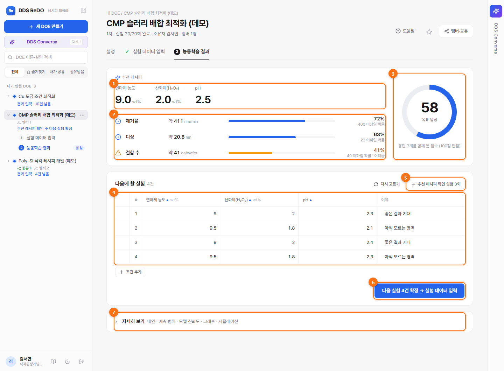
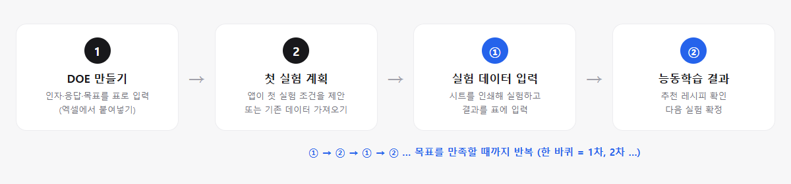

# DDS ReDO — Recipe Design Optimization

개발 단계의 공정 레시피를 **적은 실험으로** 찾는 **산포 인지형 능동학습 DOE** 웹앱입니다 (DDS 플랫폼 모듈).
엔지니어는 앱이 제안한 조건으로 실험하고 결과만 입력합니다. 앱은 평균(μ)과 **산포**(σ)를 함께 학습해, 흔들림이 작은(강건한) **추천 레시피**와 **다음에 할 실험**을 제안합니다.



- **처음 쓰는 분**: [사용 매뉴얼](docs/USER_MANUAL.md) (그림으로 보는 단계별 안내). 앱 안에서는 사이드바 아래 📖 버튼이나 DOE 화면의 **도움말**로 HTML 매뉴얼(`/manual/index.html`)이 새 창으로 열립니다.
- **이 UI 디자인을 다른 프로젝트에 쓰려면**: [DESIGN.md](DESIGN.md) (토큰·컴포넌트·레이아웃·UX 규칙, 복사해 쓰는 [tokens.css](frontend/src/design/tokens.css) + [kit.css](frontend/src/design/kit.css), [미리보기](docs/design/preview.html))
- **개발자**: 개발 지침은 [`CLAUDE.md`](CLAUDE.md), 현재 상태와 남은 작업은 [`docs/HANDOFF.md`](docs/HANDOFF.md)를 보세요.

## 사용 흐름



1. **DOE 만들기**: 인자·응답·목표를 표로 입력합니다(엑셀 표를 붙여넣어도 됩니다). 이미 해 둔 실험 데이터가 있으면 그 표에서 설정을 자동으로 채울 수 있습니다.
2. **첫 실험 계획**: 앱이 인자 공간을 고르게 덮는 첫 실험(반복 포함)을 만들거나, 기존 데이터를 가져와 시작합니다.
3. **① 실험 데이터 입력**: 실험 시트(QR 포함)를 인쇄해 실험하고, 결과를 엑셀처럼 입력하거나 붙여넣습니다. 입력은 자동 저장됩니다.
4. **② 능동학습 결과**: 추천 레시피, 목표 달성 점수, 응답별 규격 만족 확률을 보고 다음 실험을 확정합니다. 이 과정을 ①→②로 반복합니다.

## 주요 기능

| 영역 | 기능 |
|---|---|
| 모델링 | 이분산 Gaussian Process (평균 GP + log(s²) 산포 GP), 산포·모델 불확실성 분리, LOO 검증(커버리지·RMSE), TabPFN(실험적, 기능 플래그) |
| 최적화 | 다목적(Desirability) 레시피 최적화, 규격 만족 확률·평균∓kσ·품질 손실 기준, 파레토 대안, 후보 풀 기반 획득 + Kriging Believer 배치, 부분 완료 상태에서 다음 제안 |
| 입력 | 엑셀식 그리드(Enter 이동·붙여넣기·드래그 복사), 머리글·런 ID 자동 매칭, 즉시 검증(형식·허용 범위·예측 이탈), 자동 저장·오프라인 임시 저장, 태블릿 카드 입력, QR 실험 시트 |
| 데이터 | 기존 실험 데이터 가져오기(0차, 중복 감지), 기존 데이터에서 DOE 설정 자동 생성, 엑셀(.xlsx) 다운로드 — 사내 보안상 파일 **업로드**는 없음(클립보드 사용) |
| 분석 | 평균·산포·불확실성·확률 지도, 인자별 영향, 모든 응답을 한 번에 보는 조건 시뮬레이션 |
| 협업 | 멤버 역할(소유자·편집자·실험자·열람자), 예측 페이지 공유(사람·부서·사업부·전사, 스냅샷/실시간, 만료·철회·열람 기록), 감사 로그 |
| 화면 | 미니멀 디자인, 다크 모드, 사이드바 너비 조절·접기(Ctrl+B), 주요 작업은 클릭 5번 이내 |
| 보안 | 서버 측 권한 검사(IDOR 차단), 사내 인증 어댑터(Mock은 개발 전용), CSRF 헤더, 외부 CDN·텔레메트리 없음(폰트 포함 모두 번들) |

## AI 도우미 DDS Conversa · MCP (사내 LLM)

사내 LLM(Ollama)으로 앱을 **말로 조작**합니다. "1차-03 제거율 412 입력해 줘", "추천 레시피 설명해 줘", "증착공정개발팀에 공유해 줘" 같은 요청을 처리합니다.
데이터는 사내 LLM으로만 보내고, 모든 작업은 **로그인한 사용자의 권한** 안에서만 동작합니다.

**켜는 방법 — LLM 정보 두 줄만 등록**
```powershell
# backend/.env (예시: backend/.env.example)
REDO_LLM_BASE_URL=http://ollama.사내도메인:11434   # Ollama 주소
REDO_LLM_MODEL=qwen2.5:14b                         # 도구 호출(tools)을 지원하는 모델
```
서버를 다시 시작하면 사이드바의 **DDS Conversa**(Ctrl+J)가 켜집니다. 연결 상태는 `GET /api/assistant/status`에서 확인합니다.
OpenAI 호환 게이트웨이를 쓰면 `REDO_LLM_PROVIDER=openai`(+ 필요하면 `REDO_LLM_API_KEY`)로 바꿉니다.

**안전장치**
- 업무 단위 도구 23개(`backend/app/assistant/tools.py`)만 엽니다.
  - 읽기 9개: DOE·실험 조회, 추천, 예측, 다음 실험 제안, 사용법 찾기, 화면 이동, 멤버·공유 보기
  - 쓰기 7개: DOE 만들기, 첫 실험, 결과 입력, 기존 데이터, 다음 실험 확정, 실패 표시, DOE 되살리기
  - 위험 7개: 삭제, 런 삭제, 공유, 공유 철회, 멤버 추가·변경, 멤버 내보내기, 소유권 이전
- 쓰기는 **확인 카드 → [실행]**, 위험 작업은 **"정말 실행할까요?" 재확인**까지 거쳐야 실행됩니다(서버가 강제).
- 확인 카드는 서명된 토큰입니다. 10분 동안만 유효하고, 본인만, 한 번만 실행할 수 있습니다. LLM은 이 단계를 건너뛸 수 없습니다.
- 감사 로그에 `via=assistant`(화면 대화), `via=mcp`(MCP), `via=api`(개인 토큰)로 남습니다.

**MCP 서버** — 사내 MCP 클라이언트(에이전트·IDE)에서 같은 도구를 씁니다.
- 주소: `http(s)://<앱 주소>/mcp` (Streamable HTTP, JSON-RPC)
- 인증: 개인 토큰 `Authorization: Bearer redo_…`. DDS Conversa 창의 🔗 **MCP 연결**에서 발급·폐기하며, 설정 예시를 복사할 수 있습니다.
- 쓰기 도구는 `confirm=true`, 위험 도구는 `confirm_again=true`까지 줘야 실행됩니다. 도구 annotations(`readOnlyHint`/`destructiveHint`)로 MCP 호스트가 승인 화면을 띄웁니다.
- LLM 등록과 상관없이 쓸 수 있습니다(`REDO_MCP_ENABLED=false`로 끔).

**API 설명서**: 모든 API에 한국어 요약·설명과 고정 operationId(함수 이름)가 붙어 있습니다 → `/docs`, `/openapi.json`.
결과 저장은 런 ID(`run_code: "1차-03"`)로 지정할 수 있고, `?dry_run=true`로 저장 전 미리 보기를 할 수 있습니다.

**LLM 없이 시험하기**: `python -m scripts.mock_ollama --port 8013`(정해진 답을 하는 가짜 Ollama) + `REDO_LLM_BASE_URL=http://127.0.0.1:8013 REDO_LLM_MODEL=mock`. E2E 테스트도 이것을 씁니다.

## 구조
```
backend/    FastAPI + SQLAlchemy(SQLite/PostgreSQL) + scikit-learn(GP), 선택적으로 TabPFN
  app/modeling/   대리모델·획득·다목적 최적화·검증    app/auth, app/authz   인증 어댑터·권한 정책
  app/routers/    API                                    tests/                pytest (API·권한·모델)
frontend/   React + TypeScript + Vite + Plotly
  src/pages, src/guide, src/sections, src/components    e2e/  Playwright E2E
  scripts/manual-shots.mjs  사용 매뉴얼 그림 생성
docs/       HANDOFF.md(진행 상황), USER_MANUAL.md(사용 매뉴얼), (매뉴얼 그림은 frontend/public/manual/img), design/(UI 키트 미리보기)
DESIGN.md   디자인 시스템 — 다른 프로젝트에 재사용하는 방법
```

## 로컬 실행 (Windows PowerShell)
```powershell
# 백엔드
cd backend
py -3.11 -m venv .venv
.venv\Scripts\Activate.ps1
pip install -r requirements-dev.txt
python -m app.seed --reset          # 개발용 조직·사용자·데모 DOE 2개 생성
uvicorn app.main:app --port 8000

# 프론트엔드 (새 터미널)
cd frontend
npm install
npm run dev                         # http://localhost:5173  (/api 는 8000으로 프록시)
```
개발 환경(`REDO_ENV=dev`, 기본값)에서는 로그인 화면에서 Mock 사용자를 골라 들어갑니다.
데모 계정: 김서연(데모 DOE 소유자), 이도윤(실험자), 박지호(열람자·부서 공유 수신), 최유나(다른 사업부).
데모 DOE: **Poly-Si 식각 레시피 개발**(응답 2개, 2차 진행 중), **CMP 슬러리 배합 최적화**(응답 3개, 1차 완료).

> Windows에서는 `uvicorn --reload`가 멈추는 경우가 있어 `--reload` 없이 실행하고, 백엔드 코드를 바꾸면 다시 시작하세요.

## 테스트
```powershell
cd backend;  python -m pytest -q                       # API·권한·모델 테스트
cd frontend; npm run build                             # tsc --strict + 번들
cd frontend; $env:REDO_PYTHON="python"; npm run e2e    # Playwright E2E (별도 e2e.db·포트 8011/5181로 자동 기동, 설치된 Chrome 사용)
```

## 매뉴얼 그림 다시 만들기
화면이 바뀌면 [사용 매뉴얼](docs/USER_MANUAL.md)의 그림을 다시 찍습니다. 개발 DB를 건드리지 않도록 별도 DB·포트를 씁니다.
```powershell
cd backend;  $env:REDO_DATABASE_URL="sqlite:///./manual.db"; python -m app.seed --reset; python -m uvicorn app.main:app --port 8021
cd frontend; $env:REDO_API_TARGET="http://localhost:8021"; npx vite --port 5191 --strictPort
cd frontend; npm run manual:shots                      # frontend/public/manual/img/*.png 생성 (주황색 번호 표시 포함)
cd frontend; npm run manual:html                       # docs/USER_MANUAL.md → public/manual/index.html (npm run build 때 자동)
```

## 주요 환경변수 (`backend/.env`, 접두사 `REDO_`, 예시: [`backend/.env.example`](backend/.env.example))
| 변수 | 기본값 | 설명 |
|---|---|---|
| `REDO_ENV` | dev | dev / test / prod (prod에서 Mock 인증이면 기동 거부) |
| `REDO_DATABASE_URL` | sqlite:///./redo.db | PostgreSQL: `postgresql+psycopg://...` |
| `REDO_SECRET_KEY` | dev-only-change-me | 세션 서명 키 (운영 필수) |
| `REDO_AUTH_MODE` | mock | mock / corporate (사내 로그인 연계, 사양 수령 후 구현) |
| `REDO_LLM_BASE_URL` | | 사내 LLM(Ollama) 주소. 이것과 모델을 넣으면 DDS Conversa가 켜짐 |
| `REDO_LLM_MODEL` | | 모델 이름 (도구 호출 지원 모델) |
| `REDO_LLM_PROVIDER` | ollama | ollama / openai(OpenAI 호환 게이트웨이) |
| `REDO_LLM_API_KEY` | | 게이트웨이 키 (필요할 때만) |
| `REDO_LLM_NUM_CTX` | 16384 | Ollama 문맥 길이 |
| `REDO_MCP_ENABLED` | true | MCP 서버(/mcp) |
| `REDO_TABPFN_ENABLED` | false | TabPFN 기능 플래그 |
| `REDO_TABPFN_MODEL_PATH` | | 서버에 미리 받아 둔 가중치 파일 경로 |
| `REDO_TABPFN_MODEL_SHA256` | | 가중치 해시 (시작 시 검증) |

프론트엔드 개발 서버는 `REDO_API_TARGET`(기본 `http://localhost:8000`)으로 `/api`를 프록시합니다.

## TabPFN (실험적)
`pip install -r requirements-tabpfn.txt` 후 가중치를 서버에 내려받아 경로를 지정합니다. 런타임 자동 다운로드는 하지 않습니다.
패키지의 텔레메트리는 설치 버전 문서에 있는 환경변수로 끄세요. **가중치 라이선스는 버전마다 다르며, 최신 버전은 운영·사내 의사결정 사용에 상용 라이선스가 필요할 수 있습니다. 운영 전 법무 확인 필수** (CLAUDE.md 6.2절).

## 벤치마크
```powershell
cd backend
python -m scripts.benchmark --seeds 5 --iters 6 --batch 4
```
