# DDS ReDO 사용 매뉴얼

**DDS ReDO**는 적은 실험으로 공정 레시피를 찾도록 돕는 앱입니다.
실험 결과를 넣으면 앱이 학습해서 **"지금까지 가장 좋은 레시피"**와 **"다음에 해 볼 실험"**을 알려 줍니다.
통계를 몰라도 됩니다. 앱이 정해 준 조건으로 실험하고 결과만 입력하면 됩니다.

> 그림 위의 **주황색 번호**는 본문의 번호와 같습니다.
> 화면의 예시는 앱에 들어 있는 데모 DOE(CMP 슬러리 배합, Poly-Si 식각)와 새로 만든 "Cu 도금 조건 최적화"입니다.

## 목차
1. [시작하기](#1-시작하기)
2. [첫 화면 둘러보기](#2-첫-화면-둘러보기)
3. [새 DOE 만들기](#3-새-doe-만들기)
4. [첫 실험 정하기](#4-첫-실험-정하기)
5. [① 실험 데이터 입력](#5-실험-데이터-입력)
6. [② 능동학습 결과](#6-능동학습-결과)
7. [반복하고 마무리하기](#7-반복하고-마무리하기)
8. [함께 쓰기: 멤버와 공유](#8-함께-쓰기-멤버와-공유)
9. [화면 꾸미기: 사이드바·다크 모드](#9-화면-꾸미기-사이드바다크-모드)
10. [자주 묻는 질문 · 용어](#10-자주-묻는-질문--용어)
11. [단축키 모음](#11-단축키-모음)

---

## 1. 시작하기

사내 계정으로 로그인합니다. 로그인하면 원래 열려던 화면(예: 공유받은 링크)으로 바로 이동합니다.

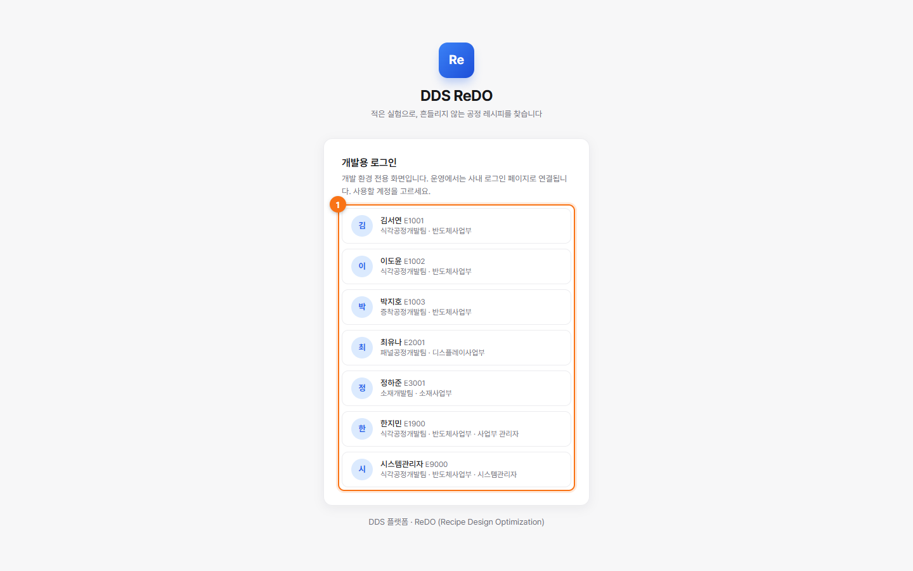

1. 개발·시험 환경에서는 사용자를 골라 들어갑니다. 실제 서비스에서는 사내 로그인 화면으로 연결됩니다.

---

## 2. 첫 화면 둘러보기

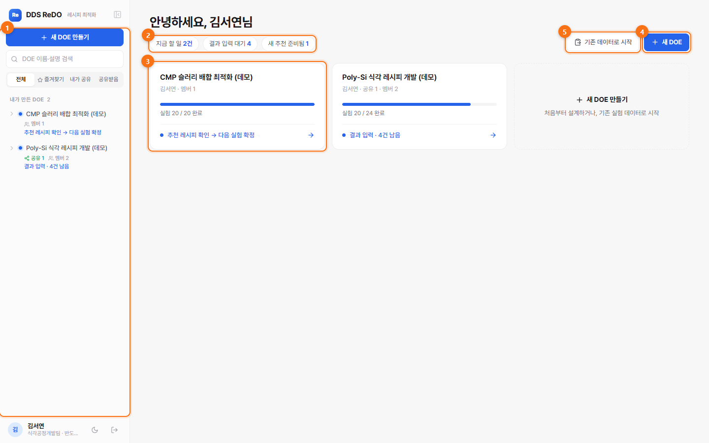

| 번호 | 이름 | 하는 일 |
|:-:|---|---|
| 1 | **DOE 목록 (사이드바)** | 내가 만든 DOE, 함께하는 DOE, 공유받은 예측이 모두 여기 있습니다. 파란 점(●)이 붙은 DOE는 **내가 할 일이 있는** DOE입니다. 이름을 누르면 설정, 펼치면 ①·② 단계로 바로 갈 수 있습니다. |
| 2 | **할 일 요약** | 지금 할 일, 결과 입력을 기다리는 실험 수, 새 추천이 준비된 DOE 수 |
| 3 | **DOE 카드** | 진행 막대와 "다음에 할 일"이 보입니다. 카드를 누르면 **할 일이 있는 단계로 바로** 갑니다. |
| 4 | **새 DOE** | 처음부터 새 DOE를 만듭니다 ([3장](#3-새-doe-만들기)). |
| 5 | **기존 데이터로 시작** | 이미 해 둔 실험 결과(엑셀 표)로 DOE를 만듭니다 ([3-2](#3-2-기존-데이터에서-만들기)). |

> **DOE**(Design of Experiments, 실험계획)는 여기서 "레시피를 찾는 프로젝트 하나"를 뜻합니다.

---

## 3. 새 DOE 만들기

한 페이지에서 모두 입력합니다. 표는 **엑셀처럼** 동작하고, 엑셀 표를 **복사해서 한 번에 붙여넣을 수** 있습니다.

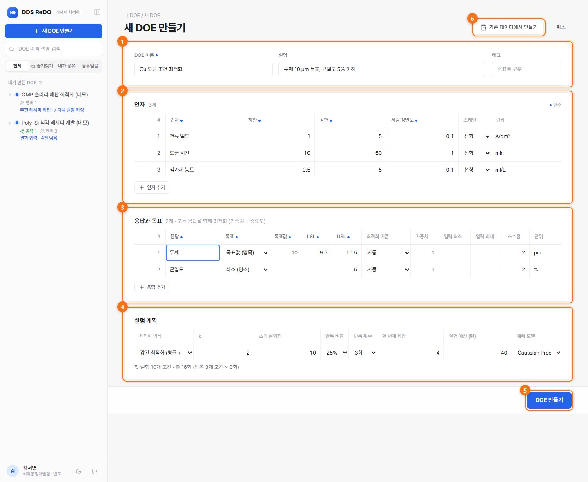

| 번호 | 항목 | 설명 |
|:-:|---|---|
| 1 | **기본 정보** | DOE 이름(필수), 설명, 태그 |
| 2 | **인자** | 바꿔 볼 조건 (예: 전류 밀도, 도금 시간) |
| 3 | **응답과 목표** | 측정할 결과와 목표 (예: 두께 10 μm, 균일도 5% 이하) |
| 4 | **실험 계획** | 첫 실험 수, 반복 측정, 한 번에 제안받을 실험 수, 실험 예산 |
| 5 | **DOE 만들기** | 저장합니다. 빠진 칸이 있으면 빨갛게 표시됩니다. |
| 6 | **기존 데이터에서 만들기** | 엑셀 데이터에서 인자·응답을 자동으로 채웁니다 ([3-2](#3-2-기존-데이터에서-만들기)). |

머리글 옆의 **파란 점(●)**은 꼭 채워야 하는 칸입니다.

### 3-1. 표의 칸 설명

**인자 표**

| 칸 | 뜻 | 예 |
|---|---|---|
| 인자 ● | 조건 이름 | 전류 밀도 |
| 하한 ● · 상한 ● | 실험할 수 있는 범위 | 1 ~ 5 |
| 세팅 정밀도 ● | 장비에서 실제로 맞출 수 있는 최소 단위. 앱이 제안하는 값은 이 단위로 반올림됩니다. | 0.1 |
| 스케일 | 값이 10배씩 차이 나는 인자(농도 등)는 **로그** | 선형 |
| 단위 | 표시용 | A/dm² |

**응답과 목표 표**

| 칸 | 뜻 |
|---|---|
| 응답 ● | 측정 항목 이름 |
| 목표 ● | **최대(망대)**: 클수록 좋음 · **최소(망소)**: 작을수록 좋음 · **목표값(망목)**: 특정 값에 맞출수록 좋음 |
| 목표값 | 망목일 때 맞추려는 값 (망목이면 필수) |
| LSL · USL | 규격 하한·상한. 있으면 "규격 안에 들 확률"로 평가합니다. |
| 최적화 기준 | 보통 **자동**으로 두세요. 규격이 있으면 규격 만족 확률, 없으면 평균과 산포를 함께 봅니다. |
| 가중치 | 응답이 여러 개일 때 중요도 (기본 1, 0이면 관찰만) |
| 입력 최소 · 최대 | 결과를 입력할 때 오타를 잡는 범위 (예: 82를 820으로 잘못 친 경우) |
| 소수점 | 결과 표시 자리수 |

> **팁: 엑셀에서 붙여넣기**
> 엑셀에서 머리글 행까지 복사한 뒤, 표의 첫 칸을 누르고 **Ctrl+V** 하세요.
> 머리글 이름으로 열을 찾아 넣으므로 엑셀의 열 순서가 달라도 됩니다. 행이 모자라면 자동으로 늘어납니다.
> 목표 칸에는 "망대", "망소", "망목", "최대" 같은 글자를 그대로 붙여넣어도 됩니다.

### 3-2. 기존 데이터에서 만들기

이미 해 둔 실험 결과가 엑셀에 있다면, 표를 붙여넣기만 하면 인자·응답 설정을 앱이 채워 줍니다.

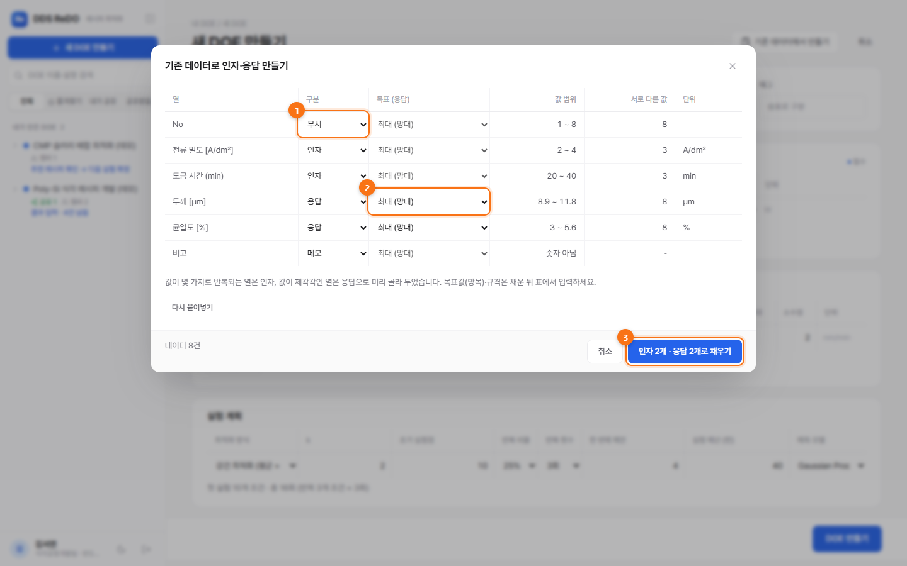

1. **구분**: 열마다 인자 / 응답 / 메모 / 무시를 고릅니다. 앱이 미리 골라 둡니다. 값이 몇 가지로 반복되는 열은 인자, 값이 제각각인 열은 응답, "No"나 "비고" 같은 열은 무시나 메모로 고릅니다.
2. **목표**: 응답 열의 목표(최대/최소/목표값)를 고릅니다.
3. **채우기**: 누르면 인자 범위(데이터의 최소~최대), 세팅 정밀도(소수 자리), 단위가 자동으로 채워집니다. 목표값이나 규격(LSL·USL)은 채운 뒤 표에서 입력하세요.

이렇게 만든 DOE는 **DOE 만들기 + 데이터 N건 가져오기** 버튼 한 번으로 생성과 데이터 가져오기가 함께 끝나고, 바로 [② 능동학습 결과](#6-능동학습-결과)로 이동합니다.

---

## 4. 첫 실험 정하기

DOE를 만들면 어떻게 시작할지 고르는 화면이 나옵니다.

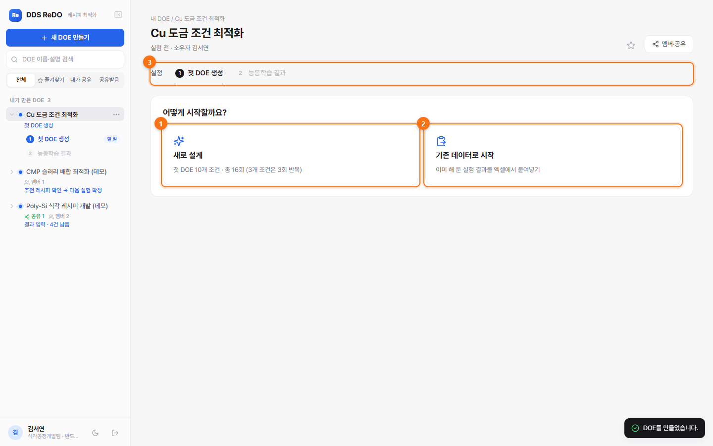

1. **새로 설계**: 앱이 인자 범위 전체를 고르게 살펴보는 첫 실험 조건을 만들어 줍니다. 일부 조건은 일부러 2~3번 반복합니다(반복해야 산포를 알 수 있기 때문).
2. **기존 데이터로 시작**: 이미 해 둔 실험 결과를 붙여넣어 시작합니다.
3. DOE 안의 화면은 위쪽 탭으로 오갑니다: **설정 · ① 실험 데이터 입력 · ② 능동학습 결과**.

### 기존 데이터 가져오기

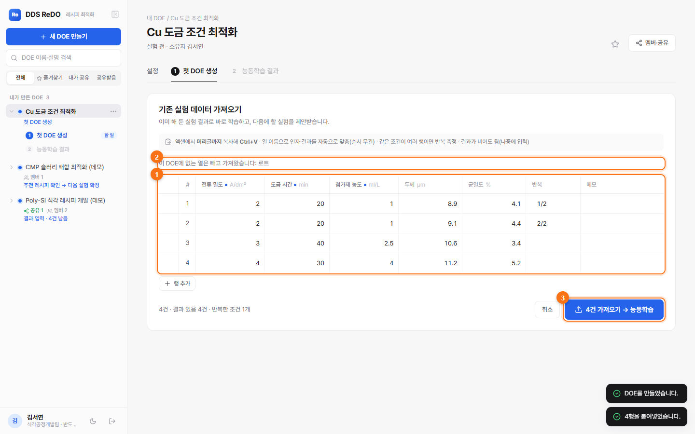

1. 엑셀 표를 **머리글까지 복사해 Ctrl+V** 하면 열 이름으로 인자·결과를 찾아 넣습니다. 같은 조건이 여러 행이면 **반복(1/2, 2/2)**으로 표시합니다.
2. DOE에 없는 열(예: 로트 번호)은 빼고 가져오며, 무엇을 뺐는지 알려 줍니다.
3. **가져오기**를 누르면 "0차" 실험으로 저장됩니다(런 ID `0차-01`…). 이후 앱이 제안하는 실험은 1차부터입니다.

- 인자 값은 **반올림하지 않고** 실제로 세팅한 값 그대로 학습합니다.
- 설정 범위 밖의 값이 있으면 **범위 넓히기** 또는 **범위 밖 행 빼기**를 고를 수 있습니다.
- 이미 DOE에 있는 실험과 **똑같은 행**은 중복으로 알려 줍니다. 같은 데이터를 두 번 넣으면 반복 측정으로 잘못 학습되니 **중복 행 빼기**를 누르세요.
- 결과가 빈 행도 가져올 수 있습니다. 나중에 ① 화면에서 채우면 됩니다.

---

## 5. 실험 데이터 입력

이번 차수에 할 실험 목록이자 결과 입력 표입니다.

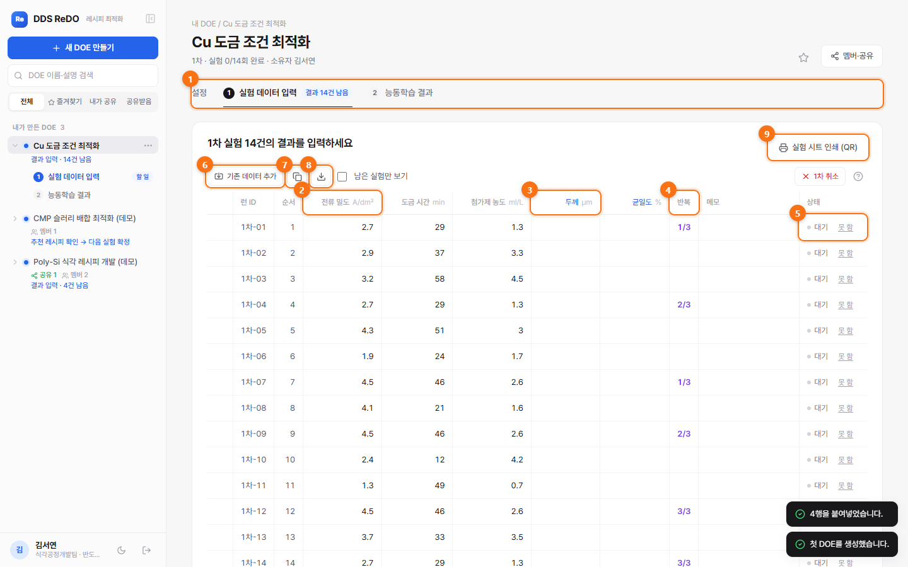

| 번호 | 이름 | 설명 |
|:-:|---|---|
| 1 | **단계 탭** | 남은 결과 수가 함께 보입니다 ("결과 14건 남음"). |
| 2 | **조건 칸** | 실험할 조건. 실제로 다르게 세팅했다면 **그대로 고쳐 쓰면** 됩니다(노란색으로 표시, 학습에는 실제 값을 씁니다). |
| 3 | **결과 칸** | 측정값을 입력합니다. |
| 4 | **반복** | 같은 조건을 여러 번 하는 실험은 `1/3`(3번 중 첫 번째)처럼, 지난 차수의 조건을 다시 하면 `재확인`으로 표시합니다. |
| 5 | **상태** | 결과를 모두 넣으면 자동으로 **완료**. 실험을 못 했으면 **못 함**을 누릅니다. |
| 6 | **기존 데이터 추가** | 예전에 해 둔 실험 결과를 더 넣습니다. |
| 7 | **표 일괄 복사** | 표 전체를 머리글과 함께 복사합니다 (엑셀에 붙여넣기). |
| 8 | **엑셀 파일로 다운로드** | 표를 `.xlsx` 파일로 받습니다 (DOE 설정 시트 포함). |
| 9 | **실험 시트 인쇄** | 현장에서 쓸 A4 시트를 인쇄합니다. |

- 런 ID `1차-03`은 "1차 실험의 3번째 런"이라는 뜻입니다. **순서**는 실험할 순서(무작위)입니다. 순서대로 하면 시간에 따른 장비 변화가 결과에 섞이는 것을 줄일 수 있습니다.
- 행 맨 앞의 휴지통은 마우스를 올리면 보입니다. 지운 런은 표와 학습에서 빠지지만, 기록은 남아 복구할 수 있습니다.
- 표 오른쪽 위 **?** 에 사용법이 요약되어 있습니다.

### 5-1. 실험 시트 인쇄

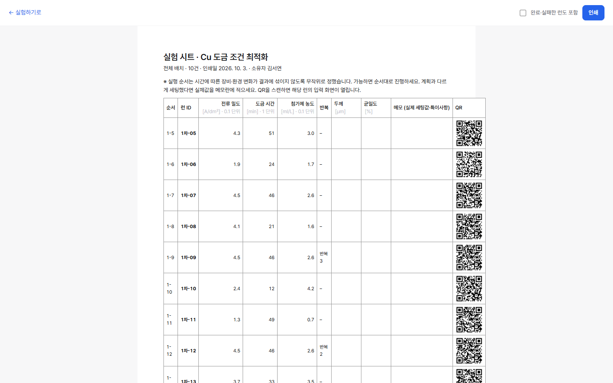

런마다 조건과 결과를 적는 칸, **QR 코드**가 있습니다. 태블릿이나 휴대폰으로 QR을 찍으면 그 런의 입력 화면이 바로 열려 현장에서 결과를 넣을 수 있습니다.

### 5-2. 결과 넣기 (직접 입력 또는 엑셀 붙여넣기)

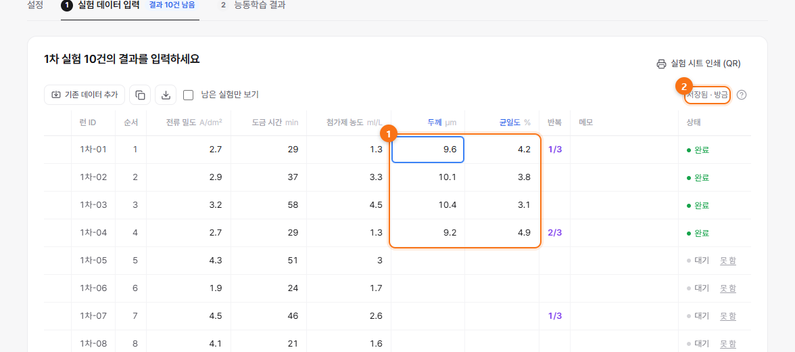

1. 결과 칸을 누르고 입력한 뒤 **Enter**를 누르면 아래 칸으로 내려갑니다. 엑셀에서 여러 칸을 복사해 **Ctrl+V** 하면 한 번에 들어갑니다.
   - 머리글이나 런 ID 열을 같이 복사해도 됩니다. 앱이 알맞은 행·열을 찾아 넣습니다(예전 형식 `B1-02`도 인식).
2. 입력하면 **자동 저장**됩니다. "저장됨"이 보이면 끝입니다. 네트워크가 끊겨도 입력은 이 브라우저에 임시 보관되고, 다시 연결되면 저장됩니다.

입력 칸 색의 뜻:

| 색 | 뜻 | 어떻게 하나요 |
|---|---|---|
| 빨간 칸 | 숫자가 아님 → 저장 안 됨 | 값을 고치세요 |
| 노란 칸 | 입력 허용 범위 밖이거나 예측과 크게 다름 → **저장은 됨** | 값과 단위를 한 번 더 확인하세요 (진짜 발견일 수도 있습니다) |
| 노란 글자(조건 칸) | 계획과 다르게 세팅함 | 실제 세팅값이면 그대로 두세요 |

### 5-3. 못 한 실험 표시

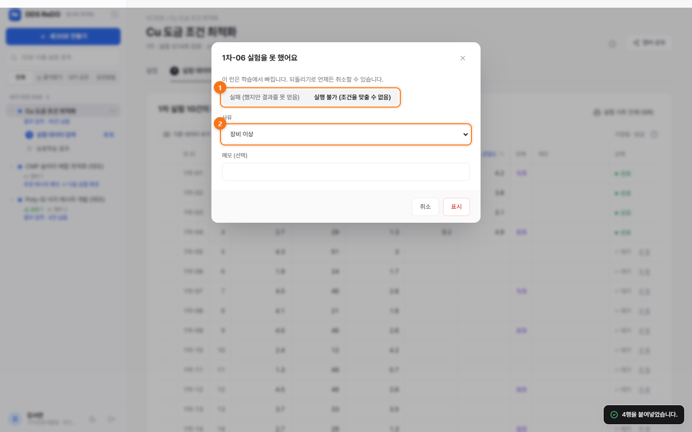

**못 함**을 누르면 이 창이 뜹니다.

1. **실패**(실험은 했지만 결과를 못 얻음) 또는 **실행 불가**(그 조건을 맞출 수 없음)를 고릅니다.
2. 사유를 고르고 필요하면 메모를 남깁니다.

이 런은 학습에서 빠집니다. 실수로 눌렀다면 상태 칸의 **되돌리기**를 누르세요.

### 5-4. 표의 일부만 복사하기

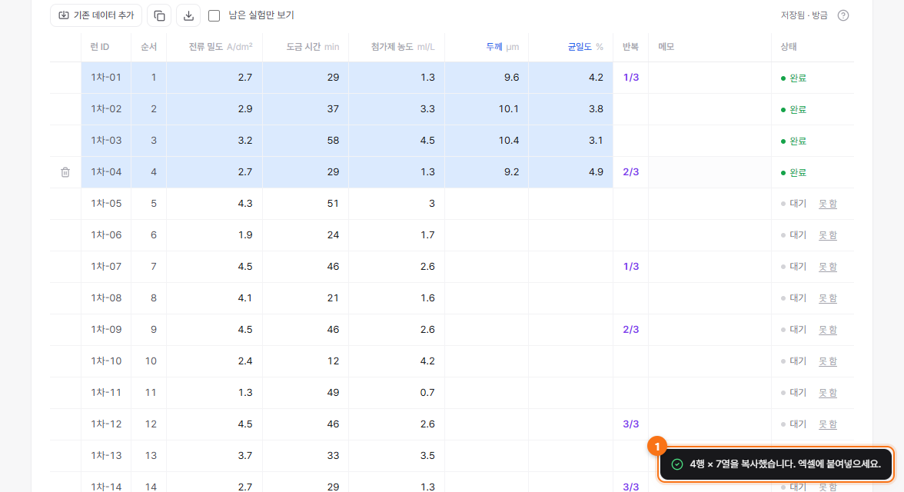

칸을 누른 채 끌면 여러 행·열을 고를 수 있습니다(Shift+클릭도 가능, 머리글을 누르면 그 열 전체).
**Ctrl+C**를 누르면 고른 칸만 복사되어 엑셀에 바로 붙여넣을 수 있습니다(1).
범위를 고른 채 **Ctrl+V** 하면 그 범위의 왼쪽 위 칸부터 붙여넣습니다. **Esc**를 누르면 선택이 풀립니다.

> 결과를 다 넣었으면 오른쪽 아래 **다음: 능동학습 →** 을 누르세요. 결과가 일부만 들어가 있어도 넘어갈 수 있습니다(빈 실험은 학습에서 빠지고, 다음 제안은 그 조건과 겹치지 않게 고릅니다).

---

## 6. 능동학습 결과

앱이 지금까지의 결과로 학습해서 **추천 레시피**와 **다음에 할 실험**을 보여 줍니다.

| 번호 | 이름 | 읽는 법 |
|:-:|---|---|
| 1 | **추천 레시피** | 지금까지 학습한 결과로 가장 좋다고 예측되는 조건입니다. |
| 2 | **응답별 예상** | 그 조건에서의 예상값과 **규격 안에 들 확률**. 막대가 길수록 좋고, 확률이 낮은 응답은 주황색과 ⚠로 표시됩니다. |
| 3 | **목표 달성 점수** | 모든 응답을 함께 본 점수(100점 만점). 응답끼리 서로 충돌하면(예: 제거율↑ ↔ 결함↓) 100점이 어려울 수 있습니다. |
| 4 | **다음에 할 실험** | 앱이 고른 다음 실험 조건입니다. 엑셀처럼 고치거나 붙여넣을 수 있고, **조건 추가**로 직접 넣을 수도 있습니다. |
| 5 | **추천 레시피 확인 실험 3회** | 추천 레시피를 3번 반복하는 실험을 목록에 더합니다. 예측대로 재현되는지 확인할 때 씁니다. |
| 6 | **확정** | 목록을 다음 차수 실험으로 확정하고 ① 화면으로 갑니다. |
| 7 | **자세히 보기** | 예측 범위, 다른 선택지, 모델 신뢰도, 그래프, 조건 시뮬레이션 |

**다음 실험의 "이유"**
- **좋은 결과 기대**: 더 좋은 레시피가 있을 것 같은 곳
- **아직 모르는 영역**: 데이터가 부족해 확인이 필요한 곳
- **반복 측정**: 같은 조건에서 얼마나 흔들리는지(산포)를 알기 위한 반복

> 실험이 적을 때는 "아직 실험이 적어 예측이 정확하지 않을 수 있습니다"가 표시됩니다. 이때의 추천은 **후보**로만 보고, 다음 실험을 하면서 좁혀 가세요.

### 6-1. 자세히 보기

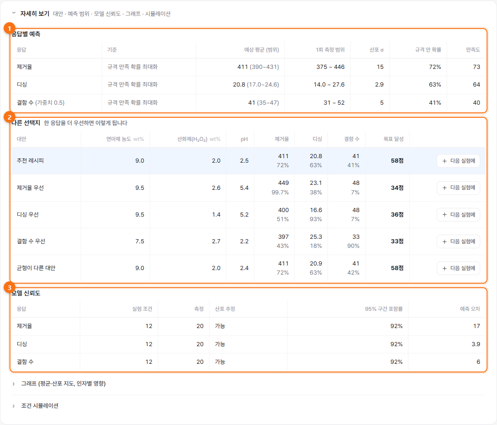

1. **응답별 예측**
   - **예상 평균 (범위)**: 평균이 있을 법한 범위
   - **1회 측정 범위**: 한 번 측정했을 때 나올 수 있는 값의 범위 (산포 포함)
   - **산포 σ**: 같은 조건에서 반복했을 때 흔들리는 정도
2. **다른 선택지**: 한 응답을 더 우선하면 레시피가 어떻게 달라지는지 보여 줍니다. **다음 실험에**를 누르면 그 조건을 다음 실험 목록에 넣습니다.
3. **모델 신뢰도**: 예측이 실제 결과를 얼마나 잘 맞히는지 스스로 점검한 결과입니다. **95% 구간 포함률**이 크게 낮으면 ⚠와 함께 안내가 나옵니다(실험을 더 하거나 범위를 확인하세요).

### 6-2. 그래프

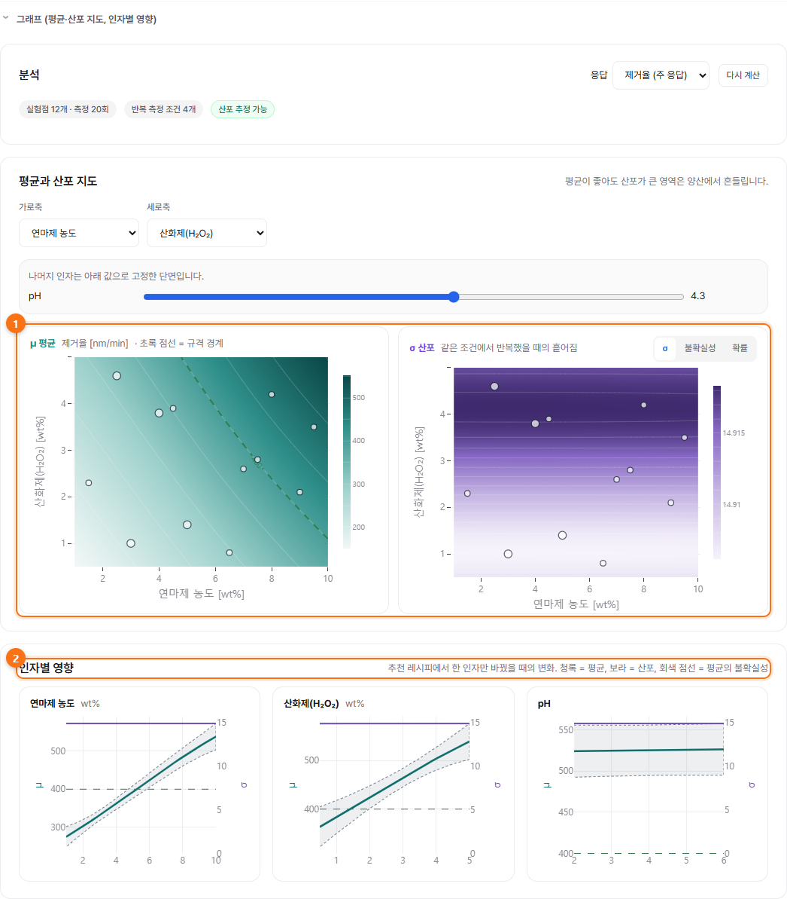

1. **평균 지도(청록)**와 **산포 지도(보라)**를 나란히 보여 줍니다. 가로·세로축 인자를 고르고, 나머지 인자는 슬라이더로 정합니다. 점은 실제 실험한 조건이고, 초록 점선은 규격 경계입니다.
   - 평균이 좋아도 **산포가 큰 영역**(보라가 진한 곳)은 양산에서 결과가 흔들립니다. 두 지도를 함께 보세요.
   - 산포 지도 오른쪽 위에서 **불확실성**(아직 데이터가 부족한 정도)과 **확률**(규격 만족 확률) 지도로 바꿀 수 있습니다.
2. **인자별 영향**: 추천 레시피에서 인자 하나만 바꿨을 때 평균(청록)과 산포(보라)가 어떻게 변하는지 보여 줍니다.

### 6-3. 조건 시뮬레이션

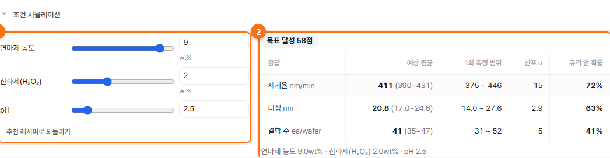

1. 슬라이더나 숫자로 조건을 바꿔 보세요.
2. 모든 응답의 예상값, 규격 확률, 목표 달성 점수가 바로 계산됩니다. 실험한 범위 밖이면 "외삽" 경고가 붙습니다.

---

## 7. 반복하고 마무리하기

**② 확정 → ① 실험·입력 → ② 결과 확인**을 반복하면 1차, 2차, 3차…로 쌓이며 추천이 점점 정확해집니다.

멈출 때를 고르는 기준(결정은 사용자가 합니다):
- 목표 달성 점수가 충분히 높고, 몇 차수 동안 크게 오르지 않는다
- 응답별 규격 확률이 원하는 수준이다
- 실험 예산을 다 썼다

마무리할 때는 **추천 레시피 확인 실험 3회**를 넣어 예측대로 재현되는지 꼭 확인하세요. 끝난 DOE는 **설정** 탭 아래 막대의 상태를 "완료"나 "보관"으로 바꿉니다.

> **설정 바꾸기**: DOE 이름을 누르거나 **설정** 탭에서 언제든 바꿀 수 있습니다.
> 실험 데이터가 있어도 **인자를 추가**할 수 있습니다. 이때 그동안 그 인자를 어떤 값에 고정해 두었는지 "기존 실험 값"을 입력합니다.
> 바꾼 내용은 **변경 이력 보기**에 남습니다.

---

## 8. 함께 쓰기: 멤버와 공유

DOE 머리글 오른쪽의 **멤버·공유**를 누릅니다.

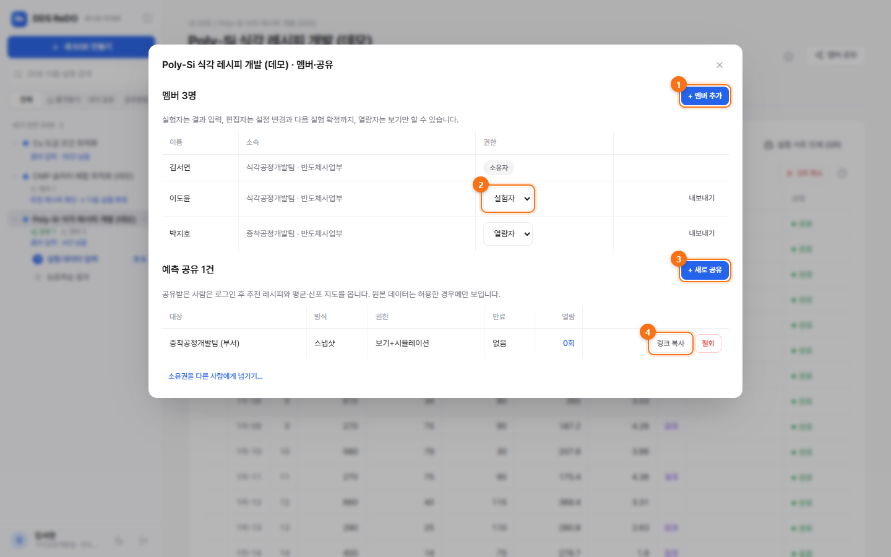

1. **멤버 추가**: 함께 일할 사람을 검색해 추가합니다.
2. **권한**: 멤버마다 바꿀 수 있습니다.
3. **새로 공유**: 추천 레시피와 지도를 다른 사람·부서에 보여 줍니다(예측 페이지 공유).
4. **링크 복사**: 공유 링크를 복사해 메신저로 보냅니다. **철회**를 누르면 즉시 볼 수 없게 됩니다.

| 권한 | 할 수 있는 일 |
|---|---|
| 소유자 | 모든 일, 멤버·공유 관리, 삭제, 소유권 넘기기 |
| 편집자 | 설정 변경, 다음 실험 확정, 결과 입력 |
| 실험자 | 결과 입력, 못 함 표시, 메모 |
| 열람자 | 보기만 |

### 예측 페이지 공유하기

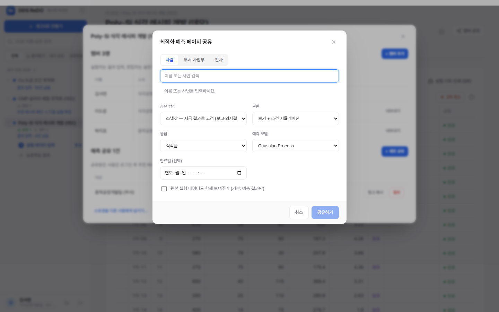

- **대상**: 위쪽 탭에서 **사람 / 부서·사업부 / 전사**를 고르고, 이름이나 사번으로 검색합니다.
- **공유 방식**: **스냅샷**(지금 결과로 고정 — 보고·의사결정용, 기본값) 또는 **실시간**(항상 최신 결과)
- **권한**: 보기만 / 보기 + 조건 시뮬레이션
- **응답 · 예측 모델**: 공유 페이지에서 보여 줄 응답과 예측 모델
- **만료일**(선택): 정하지 않으면 철회할 때까지 볼 수 있습니다.
- **원본 실험 데이터도 함께 보여주기**: 기본은 꺼져 있습니다(예측 결과만 공유).

### 공유받은 사람이 보는 화면

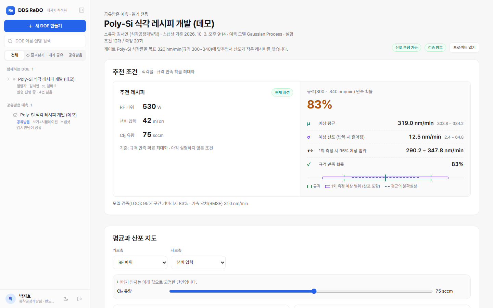

공유받은 사람은 로그인한 뒤 사이드바의 **공유받은 예측**이나 링크로 들어옵니다. 읽기 전용이며, 추천 조건, 예상 평균·산포, 규격 만족 확률, 지도를 볼 수 있습니다.
공유 대상이 아닌 사람이 링크를 열면 "접근 권한이 없습니다"와 **접근 요청** 버튼이 보입니다.

### DOE 메뉴 (즐겨찾기 · 복제 · 삭제)

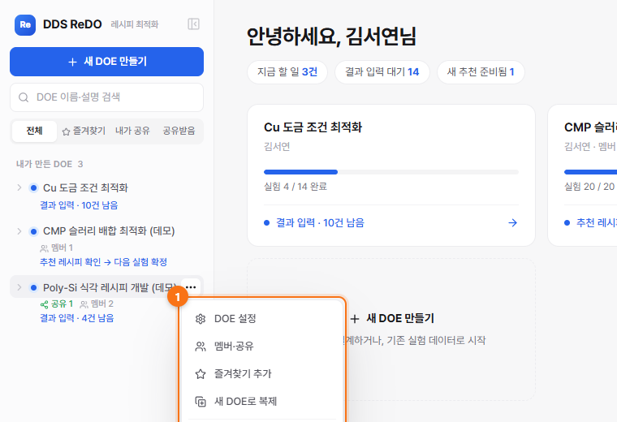

사이드바의 DOE 이름 옆 **⋯** 을 누르거나 DOE를 **마우스 오른쪽 버튼**으로 누르면 메뉴가 열립니다.
- **즐겨찾기**: 목록 맨 위 "즐겨찾기" 묶음에 표시됩니다.
- **새 DOE로 복제**: 인자·응답 설정만 복사해 새 DOE를 시작합니다(실험 데이터는 복사하지 않음).
- **삭제**(소유자만): 멤버와 공유받은 사람도 더 이상 볼 수 없습니다. 서버에는 일정 기간 보관되므로, 실수로 지웠다면 그 기간 안에 관리자에게 복구를 요청하세요.

---

## 9. 화면 꾸미기: 사이드바·다크 모드

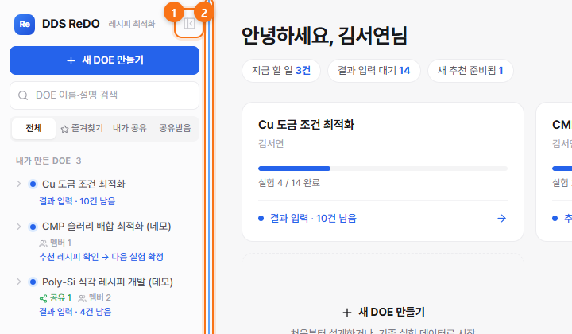

1. **사이드바 접기**: 표가 넓을 때 사이드바를 접어 작업 공간을 넓힙니다. 단축키 **Ctrl+B**.
2. **너비 조절**: 사이드바 오른쪽 가장자리를 끌어서 넓히거나 좁힙니다. **두 번 누르면** 기본 너비로 돌아갑니다.

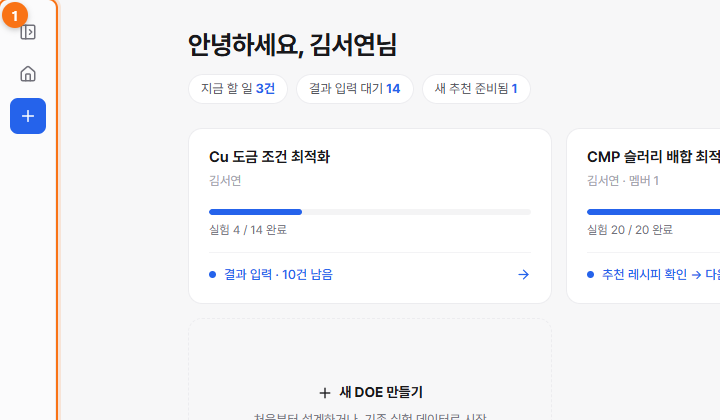

1. 접으면 아이콘만 남습니다(펼치기 · 첫 화면 · 새 DOE · 화면 모드). 펼치기 버튼이나 **Ctrl+B**로 다시 펼칩니다.

### 다크 모드

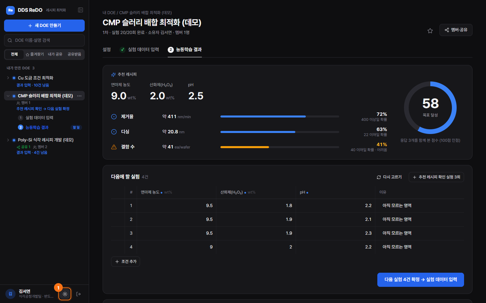

1. 사이드바 아래 **☀/☾ 버튼**으로 밝은 화면과 어두운 화면을 바꿉니다. 처음에는 컴퓨터(OS) 설정을 따르고, 한 번 바꾸면 이 브라우저에 기억됩니다.

> 사이드바 너비·접힘·화면 모드는 **이 브라우저에만** 저장됩니다. 다른 PC에서는 다시 정해야 합니다.

---

## 10. 자주 묻는 질문 · 용어

**Q. 엑셀 파일을 올릴 수는 없나요?**
사내 보안 프로그램 때문에 업로드한 엑셀·CSV 파일은 읽을 수 없습니다. 엑셀에서 **복사 → 앱에서 Ctrl+V** 하세요. 앱에서 엑셀로 가져갈 때는 표 복사(Ctrl+C) 또는 **엑셀 다운로드** 버튼을 쓰면 됩니다.

**Q. 앱이 제안한 값과 다르게 세팅했어요.**
① 화면의 조건 칸을 실제 값으로 고치세요. 학습에는 **실제 값**을 씁니다.

**Q. 이상한 값이 나왔는데 지워야 하나요?**
앱은 측정값을 자동으로 지우지 않습니다. 값과 단위를 확인하고, 측정 실수가 확실하면 그 런을 삭제하거나 다시 측정해 고치세요. 고친 값은 이전 값을 덮어쓰지 않고 새 버전으로 기록됩니다.

**Q. 결과를 일부만 넣었는데 다음 실험을 받아도 되나요?**
됩니다. 빈 실험은 학습에서 빠지고, 다음 제안은 진행 중인 실험과 겹치지 않게 고릅니다.

**Q. 반복 실험은 왜 하나요?**
같은 조건에서도 결과는 조금씩 흔들립니다(산포). 반복해야 이 흔들림을 알 수 있고, 평균이 좋으면서 **흔들림이 작은(강건한) 레시피**를 찾을 수 있습니다.

| 용어 | 뜻 |
|---|---|
| 인자 | 바꿔 볼 조건 (온도, 시간, 농도 …) |
| 응답 | 측정 결과 (두께, 균일도 …) |
| 런 | 실험 한 번 |
| 차수 | 한 번에 확정한 실험 묶음 (1차, 2차 …). 가져온 기존 데이터는 0차 |
| 반복 | 같은 조건을 여러 번 측정하는 것 |
| 산포 (σ) | 같은 조건에서 결과가 흔들리는 정도 |
| 불확실성 | 데이터가 부족해서 예측을 아직 확신하지 못하는 정도 |
| 망대 / 망소 / 망목 | 클수록 좋음 / 작을수록 좋음 / 목표값에 맞출수록 좋음 |
| LSL / USL | 규격 하한 / 상한 |
| 목표 달성 점수 | 모든 응답의 목표를 함께 만족하는 정도 (100점 만점) |
| 외삽 | 실험한 범위 밖을 예측하는 것. 정확도가 떨어집니다 |

---

## 11. 단축키 모음

| 키 | 하는 일 |
|---|---|
| Enter / Shift+Enter | 표에서 아래 / 위 칸으로 |
| ↑ ↓ | 결과 표에서 위아래 칸으로 |
| Ctrl+V | 엑셀에서 복사한 표 붙여넣기 (결과 표·가져오기 표는 칸을 고르지 않아도 됨) |
| 드래그 · Shift+클릭 → Ctrl+C | 고른 칸만 엑셀로 복사 |
| Esc | 칸 선택 해제, 창 닫기 |
| Ctrl+B | 사이드바 접기 / 펼치기 |

---

이 매뉴얼의 그림은 `frontend/scripts/manual-shots.mjs`로 다시 만들 수 있습니다 (README의 "매뉴얼 그림 다시 만들기" 참고).
